 #Cashtag
======================================

## Big data pipeline for user sentiment analysis on US stock market
[www.hashtagcashtag.com](http://www.hashtagcashtag.com)

 #Cashtag is a big data pipeline to aggregate twitter data relevant to different stocks for New York Stock Exchange (NYSE) and NASDAQ stock market and provides an analytic framework to perform user sentiment analysis on different stocks and finding the correlation with the corresponding stock price.

## What #Cashtag Does
 #Cashtag allows user to easily check the top trending stocks @twitter at different time.

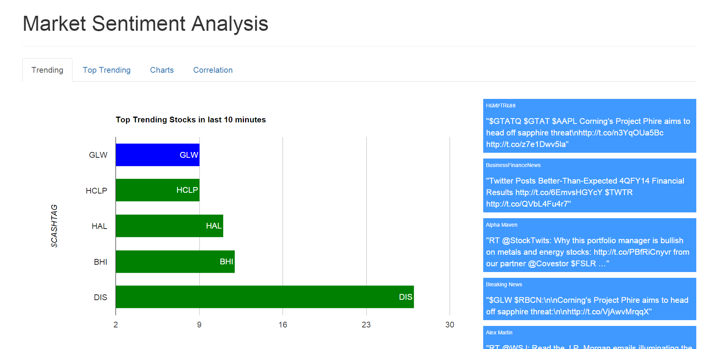

Users can look into the historical data and discover the top trending stocks and sentiment of twitter users on that stock at different hours of the day.
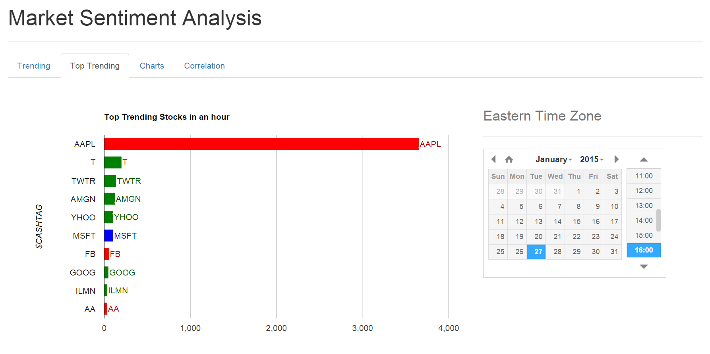

Users can also find the time series information about a stock - how many time the stock has been mentioned over time as well as corresponding sentiment. 
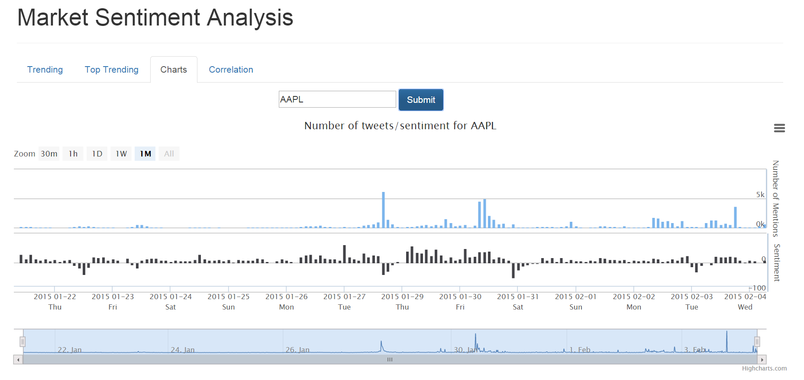

 #Cashtag also allows user to find the correlation betweent the number of mentions of a stock @twitter and the stocks price fluctuation over time.
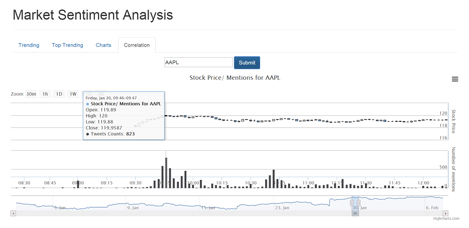

# How #Cashtag Works
 #Cashtag pipeline is based on &#x3bb; architecture.The pipeline consists of an ingestion layer, batch layer, speed layer, serving layer and frontend. The pipeline diagram is shown below:

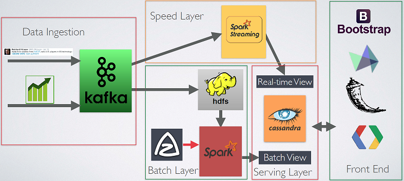 

## Data Ingestion
 #Cashtag works by pulling twitter data and stock market data. #Cashtag uses the twitter streaming API. Due to the limitation of this API, the current version is limited to pulling data for about 250 stocks including NASDAQ 100, NYSE 100 and some other popular stocks from these to exchange. 

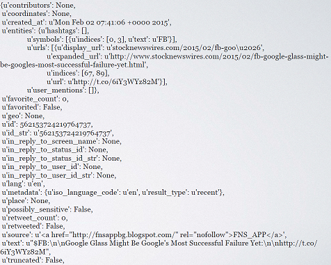
 
 #Cashtag fetches stock price information from www.netfonds.no . The website provides sub-second interval level-1 stock prices delayed by an hour. #Cashtag fetches the stock information for each individual stock every 5 seconds. Some pre-processing is done on this stock information - e.g. adding a ticker information and a timestamp. 
 
 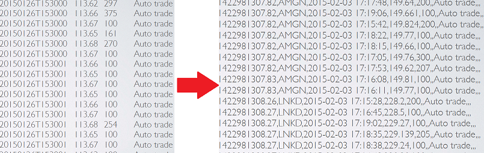
 
 A multi-consumer multi-topic Kafka instance acts as the data ingestion platform. Both twitter data and stock data are stored in the Kafka first. Python scripts are written to perform these tasks.
 
# Source of Truth
Initially, the source of truth for #Cashtag was HDFS drive in the master EC2 node. Kafka consumer programs, written in python, fetch data from Kafka and write it to HDFS. Later, the source of truth was moved to Amazon S3 drives due to the ease of use.

# Batch Layer
The choice of tool for batch layer in #Cashtag is Spark. Codes are written in Scala. Several batch layer jobs are running periodically throughout the day, where the batch layer jobs are collecting raw data from S3 disk and performing necessary tasks and saving the results in the Serving layer. Azkaban is the tool of choice in #Cashtag to perform scheduling of different batch jobs. The reason for choosing Azkaban over crontab was the nice visual user interface, the ease of parallelizing of different tasks in the flow as well as its ability to restart a program in case of failure - and of course the fact that its called Azkaban! 

Several taks are performed by the batch layer:

  1. number of mentions of a stock over different time granularity - minute, hour, day, year etc.
  2. users' sentiment of the stock over different time granularity
  3. top trending stocks at different time granularity
  4. computing the high, low, open, close and volume data of different stocks at different time granularity.
  

## Sentiment Analysis

 #Cashtag also performs a very simple sentiment analysis over different trending stocks. While the main motivation behind creating #Cashtag was to create the underlying data pipeline that will enable the end users - data scientist, analyst to perform advanced algorithmic analysis to find the sentimets, I also felt it would be interesting to showcase the ability of this platform by showing a simple sentiment analysis. For this task, #Cashtag looks for keywords in each tweets and provides a score of +1 for every positive word it encounters and a -1 for every negative word. The overall sentiment of that tweet then is the sum of all the score of all the words in the tweet.
 
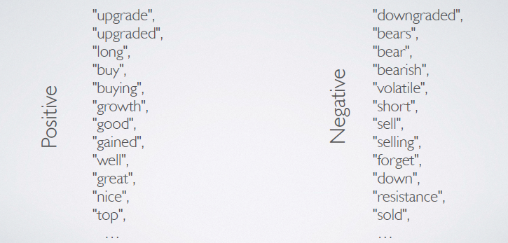

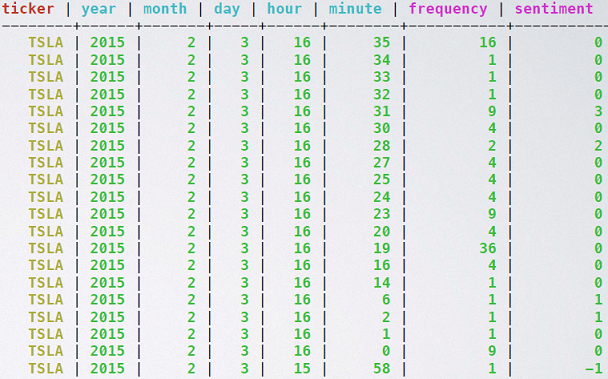
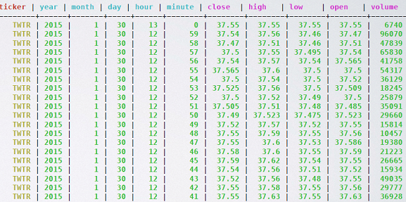

# Speed Layer

Speed layer in #Cashtag performs multiple operations. The tool of choice for speed layer is Spark Streaming. Codes are written in scala.

## Incremental algorithm to supplement batch layer

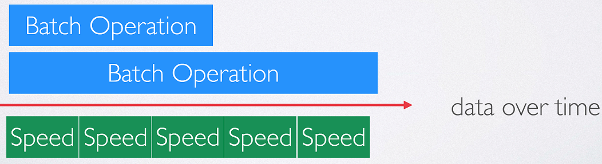

One of the motivation behind having a speed layer in lambda architecture is to supplement the batch layer. The batch layer implements re-computation algorithm that works on the entire sets of raw data and compute the necessary results. Since batch layer is working on the entire raw data set, it is generally time intensive and takes long time to process the entire sets of data. In such cases, speed layer works on the most recent data and provide real time result for these data. While the algorithm in batch layer was re-computation algorithm, the algorithm in speed layer is incremental in nature. 

In #Cashtag, one of the job of the speed layer is to find the number of mentions of a stock at different granularity. The same operation is also performed in batch layer. In speed layer in spark streaming, the data work on a window of data and make use of the 'updateStateByKey' reduce operation in Spark Streaming. Here, the key is ticker and minute level time. Whenever, the streaming job encounter a particular ticker at a particular time, it search for existing key. If found, it updates that key; if not found, it creates a new key.

## Speed layer only operation

Speed layer also calculates the top trending stocks over the last 10 minutes - this is a dashboard only operation that is being updated every 5 seconds. The spark streaming reduce operation 'reduceByKeyAndWindow' is specifally suitable for this task.

# Serving Layer

The choice of database for serving layer in #Cashtag is Cassandra. #Cashtag deals with a lot of time series data. Time series data operation is an excellent use case for Cassandra. An  excellent article on the use of time series data for Cassandra can be found in http://planetcassandra.org/getting-started-with-time-series-data-modeling/. Data from batch layer and speed layer are saved in Cassandra. We can refer to these tables as batch view and real-time view. 

 #Cashtag saves data in multiple de-normalized tables. For efficient read and write operation for both Spark and Spark Streaming to Cassandra connector, as well as for Cassandra to Frontend, the scheme design is very important. The schema for each table has been chosen carefully to make these operation efficient and simple. The schemas are described below:
 
 1. Twitter Time Series for Tab 3 and 4
  - partitioned by ticker symbol
  - clustering order by (year, month, day, hour, minute)
 2.Top Trending stocks for Tab 2
  - partitioned by (year, month, day, hour)
  - clustering order by number of mentions
 3. Stock Time Series for Tab 4
  - partitioned by ticker symbol
  - clustering order by (year, month, day, hour, minute)
  
The schema design for the rolling count dashboard in Tab 1 to represent the top trending stock in the last 10 minutes was quite tricky. Cassandra is generally a good choice for creating a rolling count dashboard due to its support for TTL (time to live) for each entry. Unfortunately, support for TTL is not available in the current Spark/Spark Streaming to Cassandra connector. As a result I need to improvise. While writing the top trending tickers to cassandra, I added a timestamp to each entry.  The Cassandra table was partitioned by ranking and clustering ordered by the time stamp. In the dashboard, the query was to select the top five stock by the ranking id and ordered descendingly by the timestamp. This gives me the latest entries from the table.

# Front End

The front end of the project is running on Flask server. The charts were created using HighStock and Google graphs. Bootstrap was the choice for rending CSS.
